# وثائق مخططات UML لنظام Lexora

## مقدمة

هذا المستند يحتوي على مخططات UML المختلفة التي تم إنشاؤها لمشروع Lexora، وهو نظام إدارة للمكتب القانوني. المخططات تهدف إلى توضيح بنية المشروع وتفاعلاته بطريقة بصرية سهلة الفهم.

## المخططات

### 1. مخطط الفئات (Class Diagram)

يوضح هذا المخطط الهيكل الداخلي للنظام من حيث الفئات والعلاقات بينها.

```plantuml
@startuml Lexora Class Diagram

' Color definitions
!define ENTITY_BG_COLOR #E3F2FD
!define DTO_BG_COLOR #FFECB3
!define CONTROLLER_BG_COLOR #E8F5E9
!define SERVICE_BG_COLOR #F3E5F5
!define REPOSITORY_BG_COLOR #FBE9E7

skinparam class {
  BackgroundColor ENTITY_BG_COLOR
  ArrowColor #0D47A1
  BorderColor #0D47A1
}

skinparam stereotypeCBackgroundColor<<DTO>> DTO_BG_COLOR
skinparam stereotypeCBackgroundColor<<Controller>> CONTROLLER_BG_COLOR
skinparam stereotypeCBackgroundColor<<Service>> SERVICE_BG_COLOR
skinparam stereotypeCBackgroundColor<<Repository>> REPOSITORY_BG_COLOR

package "Entities" {
  class Utilisateur {
    -idUtilisateur: Long
    -email: String
    -password: String
    -prenom: String
    -nom: String
    -nomComplet: String
    -telephone: String
    -dateNaissance: LocalDate
    -adresse: String
    -role: Role
    -estActive: boolean
    -dateCreation: LocalDate
    -derniereConnexion: LocalDate
    -avatar: String
    +getters/setters()
  }

  class Client {
    -idClient: Long
    -nom: String
    -contact: String
    -email: String
    -telephone: String
    -adresse: String
    -type: String
    -statut: String
    -dateCreation: LocalDate
    -notes: String
    -dossiers: Set<Dossier>
    +getters/setters()
    +addDossier(Dossier)
    +removeDossier(Dossier)
  }

  class Dossier {
    -idDossier: Long
    -reference: String
    -titre: String
    -description: String
    -type: String
    -tribunal: String
    -avocat: String
    -fichierNumero: String
    -jugeId: String
    -partieAdverse: String
    -avocatAdverse: String
    -statut: String
    -priorite: String
    -dateInitiale: LocalDate
    -dateCreation: LocalDate
    -client: Client
    -utilisateurResponsable: Utilisateur
    -sessions: Set<Session>
    -documents: Set<Document>
    -factures: Set<Facture>
    +getters/setters()
    +addSession(Session)
    +removeSession(Session)
  }

  class Session {
    -idSession: Long
    -date: LocalDate
    -heure: LocalTime
    -salle: String
    -tribunal: String
    -statut: String
    -notes: String
    -dateCreation: LocalDate
    -resultatSession: String
    -prochaineEtape: String
    -dossier: Dossier
    -utilisateurResponsable: Utilisateur
    +getters/setters()
  }

  class Document {
    -idDocument: Long
    -nom: String
    -description: String
    -type: String
    -cheminFichier: String
    -statut: String
    -dateCreation: LocalDate
    -dateAjout: LocalDate
    -dossier: Dossier
    -utilisateurAjout: Utilisateur
    +getters/setters()
  }

  class Facture {
    -idFacture: Long
    -numero: String
    -dateEmission: LocalDate
    -dateEcheance: LocalDate
    -montantHT: Double
    -tauxTVA: Double
    -montantTVA: Double
    -montantTotal: Double
    -statut: String
    -notes: String
    -client: Client
    -dossier: Dossier
    -utilisateurCreation: Utilisateur
    -elements: Set<ElementFacture>
    -paiements: Set<Paiement>
    +getters/setters()
    +addElement(ElementFacture)
    +removeElement(ElementFacture)
    +addPaiement(Paiement)
    +removePaiement(Paiement)
  }

  class ElementFacture {
    -idElement: Long
    -description: String
    -quantite: Integer
    -prixUnitaire: Double
    -montantHT: Double
    -facture: Facture
    +getters/setters()
  }

  class Paiement {
    -idPaiement: Long
    -montant: Double
    -devise: String
    -methode: String
    -datePaiement: LocalDate
    -numeroReference: String
    -banqueReference: String
    -notes: String
    -statut: String
    -cheminJustificatif: String
    -dateCreation: LocalDate
    -client: Client
    -dossier: Dossier
    -facture: Facture
    -utilisateurCreation: Utilisateur
    +getters/setters()
  }

  class Depense {
    -idDepense: Long
    -description: String
    -montant: Double
    -categorie: String
    -date: LocalDate
    -remboursable: boolean
    -statut: String
    -notes: String
    -cheminJustificatif: String
    -utilisateurCreation: Utilisateur
    -dossier: Dossier
    +getters/setters()
  }

  enum Role {
    ADMINISTRATEUR
    AVOCAT
    COMPTABLE
  }
}

package "DTOs" {
  class ClientDTO <<DTO>> {
    -idClient: Long
    -nom: String
    -contact: String
    -email: String
    -telephone: String
    -adresse: String
    -type: String
    -statut: String
    -dateCreation: LocalDate
    -notes: String
    -nombreDossiers: int
    +getters/setters()
  }

  class DossierDTO <<DTO>> {
    -idDossier: Long
    -reference: String
    -titre: String
    -description: String
    -type: String
    -tribunal: String
    -avocat: String
    -fichierNumero: String
    -jugeId: String
    -partieAdverse: String
    -avocatAdverse: String
    -statut: String
    -priorite: String
    -dateInitiale: LocalDate
    -dateCreation: LocalDate
    -clientId: Long
    -clientNom: String
    -utilisateurResponsableId: Long
    -utilisateurResponsableNom: String
    -nombreSessions: int
    -nombreDocuments: int
    -nombreFactures: int
    +getters/setters()
  }

  class SessionDTO <<DTO>> {
    -idSession: Long
    -dossierId: Long
    -dossierReference: String
    -dossierTitre: String
    -date: LocalDate
    -heure: LocalTime
    -salle: String
    -tribunal: String
    -statut: String
    -notes: String
    -dateCreation: LocalDate
    -resultatSession: String
    -prochaineEtape: String
    -utilisateurResponsableId: Long
    -utilisateurResponsableNom: String
    +getters/setters()
  }

  class DocumentDTO <<DTO>> {
    -idDocument: Long
    -nom: String
    -description: String
    -type: String
    -cheminFichier: String
    -statut: String
    -dateCreation: LocalDate
    -dateAjout: LocalDate
    -dossierId: Long
    -dossierReference: String
    -utilisateurAjoutId: Long
    -utilisateurAjoutNom: String
    +getters/setters()
  }

  class FactureDTO <<DTO>> {
    -idFacture: Long
    -numero: String
    -dateEmission: LocalDate
    -dateEcheance: LocalDate
    -montantHT: Double
    -tauxTVA: Double
    -montantTVA: Double
    -montantTotal: Double
    -statut: String
    -notes: String
    -clientId: Long
    -clientNom: String
    -dossierId: Long
    -dossierReference: String
    -utilisateurCreationId: Long
    -utilisateurCreationNom: String
    -elements: List<ElementFactureDTO>
    -paiementTotal: Double
    -solde: Double
    +getters/setters()
  }

  class ElementFactureDTO <<DTO>> {
    -idElement: Long
    -description: String
    -quantite: Integer
    -prixUnitaire: Double
    -montantHT: Double
    +getters/setters()
  }

  class PaiementDTO <<DTO>> {
    -idPaiement: Long
    -montant: Double
    -devise: String
    -methode: String
    -datePaiement: LocalDate
    -numeroReference: String
    -banqueReference: String
    -notes: String
    -statut: String
    -cheminJustificatif: String
    -dateCreation: LocalDate
    -clientId: Long
    -clientNom: String
    -dossierId: Long
    -dossierReference: String
    -factureId: Long
    -factureNumero: String
    -utilisateurCreationId: Long
    -utilisateurCreationNom: String
    +getters/setters()
  }

  class DepenseDTO <<DTO>> {
    -idDepense: Long
    -description: String
    -montant: Double
    -categorie: String
    -date: LocalDate
    -remboursable: boolean
    -statut: String
    -notes: String
    -cheminJustificatif: String
    -utilisateurCreationId: Long
    -utilisateurCreationNom: String
    -dossierId: Long
    -dossierReference: String
    +getters/setters()
  }
}

package "Controllers" {
  class AuthController <<Controller>> {
    -authService: AuthService
    +register(registrationData): ResponseEntity<?>
    +registerWithFullDetails(userData): ResponseEntity<?>
    +login(credentials): ResponseEntity<?>
    +createUser(userData): ResponseEntity<?>
    +getUserById(id): ResponseEntity<?>
  }

  class ClientController <<Controller>> {
    -clientService: ClientService
    +getAllClients(): ResponseEntity<List<ClientDTO>>
    +getClientById(id): ResponseEntity<ClientDTO>
    +createClient(clientDTO): ResponseEntity<ClientDTO>
    +updateClient(id, clientDTO): ResponseEntity<ClientDTO>
    +deleteClient(id): ResponseEntity<Void>
    +getClientsByType(type): ResponseEntity<List<ClientDTO>>
    +getClientsByStatus(statut): ResponseEntity<List<ClientDTO>>
  }

  class DossierController <<Controller>> {
    -dossierService: DossierService
    +getAllDossiers(): ResponseEntity<List<DossierDTO>>
    +getDossierById(id): ResponseEntity<DossierDTO>
    +createDossier(dossierDTO): ResponseEntity<DossierDTO>
    +updateDossier(id, dossierDTO): ResponseEntity<DossierDTO>
    +deleteDossier(id): ResponseEntity<Void>
    +getDossiersByClientId(clientId): ResponseEntity<List<DossierDTO>>
    +getDossiersByStatus(statut): ResponseEntity<List<DossierDTO>>
    +getDossiersByType(type): ResponseEntity<List<DossierDTO>>
    +getDossiersByPriority(priorite): ResponseEntity<List<DossierDTO>>
  }

  class SessionController <<Controller>> {
    -sessionService: SessionService
    +getAllSessions(): ResponseEntity<List<SessionDTO>>
    +getSessionById(id): ResponseEntity<SessionDTO>
    +createSession(sessionDTO): ResponseEntity<SessionDTO>
    +updateSession(id, sessionDTO): ResponseEntity<SessionDTO>
    +deleteSession(id): ResponseEntity<Void>
    +getSessionsByDossierId(dossierId): ResponseEntity<List<SessionDTO>>
    +getSessionsByDate(date): ResponseEntity<List<SessionDTO>>
    +getSessionsByStatus(statut): ResponseEntity<List<SessionDTO>>
    +getSessionsByDateRange(startDate, endDate): ResponseEntity<List<SessionDTO>>
    +getUpcomingSessions(): ResponseEntity<List<SessionDTO>>
  }

  class DocumentController <<Controller>> {
    -documentService: DocumentService
    +getAllDocuments(): ResponseEntity<List<DocumentDTO>>
    +getDocumentById(id): ResponseEntity<DocumentDTO>
    +createDocument(documentDTO): ResponseEntity<DocumentDTO>
    +uploadDocumentFile(id, file): ResponseEntity<DocumentDTO>
    +updateDocument(id, documentDTO): ResponseEntity<DocumentDTO>
    +deleteDocument(id): ResponseEntity<Void>
    +getDocumentsByDossierId(dossierId): ResponseEntity<List<DocumentDTO>>
    +getDocumentsByType(type): ResponseEntity<List<DocumentDTO>>
    +searchDocuments(query): ResponseEntity<List<DocumentDTO>>
  }

  class FactureController <<Controller>> {
    -factureService: FactureService
    +getAllFactures(): ResponseEntity<List<FactureDTO>>
    +getFactureById(id): ResponseEntity<FactureDTO>
    +createFacture(factureDTO): ResponseEntity<FactureDTO>
    +updateFacture(id, factureDTO): ResponseEntity<FactureDTO>
    +deleteFacture(id): ResponseEntity<Void>
    +getFacturesByClientId(clientId): ResponseEntity<List<FactureDTO>>
    +getFacturesByDossierId(dossierId): ResponseEntity<List<FactureDTO>>
    +getFacturesByStatus(statut): ResponseEntity<List<FactureDTO>>
    +getFacturesByDateRange(startDate, endDate): ResponseEntity<List<FactureDTO>>
  }

  class PaiementController <<Controller>> {
    -paiementService: PaiementService
    +getAllPaiements(): ResponseEntity<List<PaiementDTO>>
    +getPaiementById(id): ResponseEntity<PaiementDTO>
    +createPaiement(paiementDTO): ResponseEntity<PaiementDTO>
    +updatePaiement(id, paiementDTO): ResponseEntity<PaiementDTO>
    +deletePaiement(id): ResponseEntity<Void>
    +getPaiementsByClientId(clientId): ResponseEntity<List<PaiementDTO>>
    +getPaiementsByDossierId(dossierId): ResponseEntity<List<PaiementDTO>>
    +getPaiementsByFactureId(factureId): ResponseEntity<List<PaiementDTO>>
    +getPaiementsByStatut(statut): ResponseEntity<List<PaiementDTO>>
    +getPaiementsByMethode(methode): ResponseEntity<List<PaiementDTO>>
    +getPaiementsByDateRange(startDate, endDate): ResponseEntity<List<PaiementDTO>>
  }

  class DepenseController <<Controller>> {
    -depenseService: DepenseService
    +getAllDepenses(): ResponseEntity<List<DepenseDTO>>
    +getDepenseById(id): ResponseEntity<DepenseDTO>
    +createDepense(depenseDTO): ResponseEntity<DepenseDTO>
    +updateDepense(id, depenseDTO): ResponseEntity<DepenseDTO>
    +deleteDepense(id): ResponseEntity<Void>
    +getDepensesByDossierId(dossierId): ResponseEntity<List<DepenseDTO>>
    +getDepensesByStatut(statut): ResponseEntity<List<DepenseDTO>>
    +getDepensesByCategorie(categorie): ResponseEntity<List<DepenseDTO>>
    +getDepensesByDateRange(startDate, endDate): ResponseEntity<List<DepenseDTO>>
    +getReimbursableExpenses(): ResponseEntity<List<DepenseDTO>>
  }
}

package "Services" {
  interface AuthService <<Service>> {
    +register(email, password, name): Utilisateur
    +registerWithDetails(email, password, name, userData): Utilisateur
    +login(email, password): Map<String, Object>
    +getUserById(id): Utilisateur
  }

  interface ClientService <<Service>> {
    +getAllClients(): List<ClientDTO>
    +getClientById(id): Optional<ClientDTO>
    +saveClient(clientDTO): ClientDTO
    +updateClient(id, clientDTO): ClientDTO
    +deleteClient(id): void
    +getClientsByType(type): List<ClientDTO>
    +getClientsByStatus(statut): List<ClientDTO>
  }

  interface DossierService <<Service>> {
    +getAllDossiers(): List<DossierDTO>
    +getDossierById(id): Optional<DossierDTO>
    +saveDossier(dossierDTO): DossierDTO
    +updateDossier(id, dossierDTO): DossierDTO
    +deleteDossier(id): void
    +getDossiersByClientId(clientId): List<DossierDTO>
    +getDossiersByStatus(statut): List<DossierDTO>
    +getDossiersByType(type): List<DossierDTO>
    +getDossiersByPriority(priorite): List<DossierDTO>
  }

  interface SessionService <<Service>> {
    +getAllSessions(): List<SessionDTO>
    +getSessionById(id): Optional<SessionDTO>
    +saveSession(sessionDTO): SessionDTO
    +updateSession(id, sessionDTO): SessionDTO
    +deleteSession(id): void
    +getSessionsByDossierId(dossierId): List<SessionDTO>
    +getSessionsByDate(date): List<SessionDTO>
    +getSessionsByStatus(statut): List<SessionDTO>
    +getSessionsByDateRange(startDate, endDate): List<SessionDTO>
    +getUpcomingSessions(): List<SessionDTO>
  }

  interface DocumentService <<Service>> {
    +getAllDocuments(): List<DocumentDTO>
    +getDocumentById(id): Optional<DocumentDTO>
    +saveDocument(documentDTO): DocumentDTO
    +uploadDocumentFile(id, file): DocumentDTO
    +updateDocument(id, documentDTO): DocumentDTO
    +deleteDocument(id): void
    +getDocumentsByDossierId(dossierId): List<DocumentDTO>
    +getDocumentsByType(type): List<DocumentDTO>
    +searchDocuments(query): List<DocumentDTO>
  }

  interface FactureService <<Service>> {
    +getAllFactures(): List<FactureDTO>
    +getFactureById(id): Optional<FactureDTO>
    +saveFacture(factureDTO): FactureDTO
    +updateFacture(id, factureDTO): FactureDTO
    +deleteFacture(id): void
    +getFacturesByClientId(clientId): List<FactureDTO>
    +getFacturesByDossierId(dossierId): List<FactureDTO>
    +getFacturesByStatus(statut): List<FactureDTO>
    +getFacturesByDateRange(startDate, endDate): List<FactureDTO>
  }

  interface PaiementService <<Service>> {
    +getAllPaiements(): List<PaiementDTO>
    +getPaiementById(id): Optional<PaiementDTO>
    +savePaiement(paiementDTO): PaiementDTO
    +updatePaiement(id, paiementDTO): PaiementDTO
    +deletePaiement(id): void
    +getPaiementsByClientId(clientId): List<PaiementDTO>
    +getPaiementsByDossierId(dossierId): List<PaiementDTO>
    +getPaiementsByFactureId(factureId): List<PaiementDTO>
    +getPaiementsByStatut(statut): List<PaiementDTO>
    +getPaiementsByMethode(methode): List<PaiementDTO>
    +getPaiementsByDateRange(startDate, endDate): List<PaiementDTO>
  }

  interface DepenseService <<Service>> {
    +getAllDepenses(): List<DepenseDTO>
    +getDepenseById(id): Optional<DepenseDTO>
    +saveDepense(depenseDTO): DepenseDTO
    +updateDepense(id, depenseDTO): DepenseDTO
    +deleteDepense(id): void
    +getDepensesByDossierId(dossierId): List<DepenseDTO>
    +getDepensesByStatut(statut): List<DepenseDTO>
    +getDepensesByCategorie(categorie): List<DepenseDTO>
    +getDepensesByDateRange(startDate, endDate): List<DepenseDTO>
    +getReimbursableExpenses(): List<DepenseDTO>
  }

  class ClientServiceImpl <<Service>> {
    -clientRepository: ClientRepository
    +convertToDTO(client): ClientDTO
    +convertToEntity(clientDTO): Client
  }

  class DossierServiceImpl <<Service>> {
    -dossierRepository: DossierRepository
    -clientRepository: ClientRepository
    -userRepository: UserRepository
    +convertToDTO(dossier): DossierDTO
    +convertToEntity(dossierDTO): Dossier
  }

  class SessionServiceImpl <<Service>> {
    -sessionRepository: SessionRepository
    -dossierRepository: DossierRepository
    -userRepository: UserRepository
    +convertToDTO(session): SessionDTO
    +convertToEntity(sessionDTO): Session
    +updateSessionFromDTO(session, sessionDTO): void
  }

  class DocumentServiceImpl <<Service>> {
    -documentRepository: DocumentRepository
    -dossierRepository: DossierRepository
    -userRepository: UserRepository
    -uploadDirectory: String
    +convertToDTO(document): DocumentDTO
    +convertToEntity(documentDTO): Document
  }

  class FactureServiceImpl <<Service>> {
    -factureRepository: FactureRepository
    -clientRepository: ClientRepository
    -dossierRepository: DossierRepository
    -userRepository: UserRepository
    +convertToDTO(facture): FactureDTO
    +convertElementToDTO(element): ElementFactureDTO
    +convertToEntity(factureDTO): Facture
    +convertElementToEntity(elementDTO): ElementFacture
  }

  class PaiementServiceImpl <<Service>> {
    -paiementRepository: PaiementRepository
    -factureRepository: FactureRepository
    -clientRepository: ClientRepository
    -dossierRepository: DossierRepository
    -userRepository: UserRepository
    +convertToDTO(paiement): PaiementDTO
    +convertToEntity(paiementDTO): Paiement
    +updatePaiementFromDTO(paiement, paiementDTO): void
  }
}

package "Repositories" {
  interface UserRepository <<Repository>> {
    +findByEmail(email): Optional<Utilisateur>
    +findByRole(role): List<Utilisateur>
  }

  interface ClientRepository <<Repository>> {
    +findByEmail(email): Optional<Client>
    +findByType(type): List<Client>
    +findByStatut(statut): List<Client>
  }

  interface DossierRepository <<Repository>> {
    +findByClient(client): List<Dossier>
    +findByStatut(statut): List<Dossier>
    +findByType(type): List<Dossier>
    +findByPriorite(priorite): List<Dossier>
  }

  interface SessionRepository <<Repository>> {
    +findByDossier(dossier): List<Session>
    +findByDate(date): List<Session>
    +findByStatut(statut): List<Session>
    +findByDateBetween(startDate, endDate): List<Session>
  }

  interface DocumentRepository <<Repository>> {
    +findByDossier(dossier): List<Document>
    +findByType(type): List<Document>
  }

  interface FactureRepository <<Repository>> {
    +findByClient(client): List<Facture>
    +findByDossier(dossier): List<Facture>
    +findByStatut(statut): List<Facture>
    +findByDateEmissionBetween(startDate, endDate): List<Facture>
  }

  interface PaiementRepository <<Repository>> {
    +findByClient(client): List<Paiement>
    +findByDossier(dossier): List<Paiement>
    +findByFacture(facture): List<Paiement>
    +findByStatut(statut): List<Paiement>
    +findByMethode(methode): List<Paiement>
    +findByDatePaiementBetween(startDate, endDate): List<Paiement>
  }
}

' Relationships
Utilisateur "1" -- "0..*" Dossier : responsable >
Utilisateur "1" -- "0..*" Session : responsable >
Utilisateur "1" -- "0..*" Document : ajouté par >
Utilisateur "1" -- "0..*" Facture : créé par >
Utilisateur "1" -- "0..*" Paiement : traité par >
Utilisateur "1" -- "0..*" Depense : créé par >

Client "1" -- "0..*" Dossier : possède >
Client "1" -- "0..*" Facture : facturé >
Client "1" -- "0..*" Paiement : effectue >

Dossier "1" -- "0..*" Session : contient >
Dossier "1" -- "0..*" Document : contient >
Dossier "1" -- "0..*" Facture : associé >
Dossier "1" -- "0..*" Paiement : associé >
Dossier "1" -- "0..*" Depense : associé >

Facture "1" -- "0..*" ElementFacture : composé de >
Facture "1" -- "0..*" Paiement : reçoit >

' Services implementations
AuthService <|.. AuthServiceImpl
ClientService <|.. ClientServiceImpl
DossierService <|.. DossierServiceImpl
SessionService <|.. SessionServiceImpl
DocumentService <|.. DocumentServiceImpl
FactureService <|.. FactureServiceImpl
PaiementService <|.. PaiementServiceImpl
DepenseService <|.. DepenseServiceImpl

' Controllers to Services
AuthController --> AuthService
ClientController --> ClientService
DossierController --> DossierService
SessionController --> SessionService
DocumentController --> DocumentService
FactureController --> FactureService
PaiementController --> PaiementService
DepenseController --> DepenseService

' Services to Repositories
ClientServiceImpl --> ClientRepository
DossierServiceImpl --> DossierRepository
DossierServiceImpl --> ClientRepository
DossierServiceImpl --> UserRepository
SessionServiceImpl --> SessionRepository
SessionServiceImpl --> DossierRepository
SessionServiceImpl --> UserRepository
DocumentServiceImpl --> DocumentRepository
DocumentServiceImpl --> DossierRepository
DocumentServiceImpl --> UserRepository
FactureServiceImpl --> FactureRepository
FactureServiceImpl --> ClientRepository
FactureServiceImpl --> DossierRepository
FactureServiceImpl --> UserRepository
PaiementServiceImpl --> PaiementRepository
PaiementServiceImpl --> FactureRepository
PaiementServiceImpl --> ClientRepository
PaiementServiceImpl --> DossierRepository
PaiementServiceImpl --> UserRepository

@enduml
```

يوضح هذا المخطط الهيكل الداخلي للنظام من حيث:

- **الكيانات (Entities)**: تمثل الهيكل الأساسي للبيانات في النظام.
- **DTOs**: كائنات نقل البيانات المستخدمة للتواصل بين طبقات النظام.
- **وحدات التحكم (Controllers)**: تتعامل مع طلبات HTTP وتوجهها إلى الخدمات المناسبة.
- **الخدمات (Services)**: تحتوي على منطق الأعمال الأساسي.
- **المستودعات (Repositories)**: تتعامل مع قواعد البيانات.

كما يوضح المخطط العلاقات بين هذه الفئات، مثل العلاقات "واحد إلى متعدد" بين العميل والملفات.

### 2. مخطط المكونات (Component Diagram)

يوضح هذا المخطط الهيكل العام للنظام والتفاعلات بين مكوناته الرئيسية.

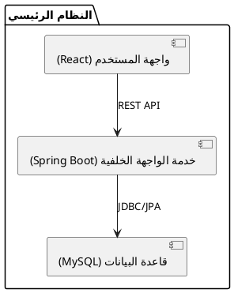

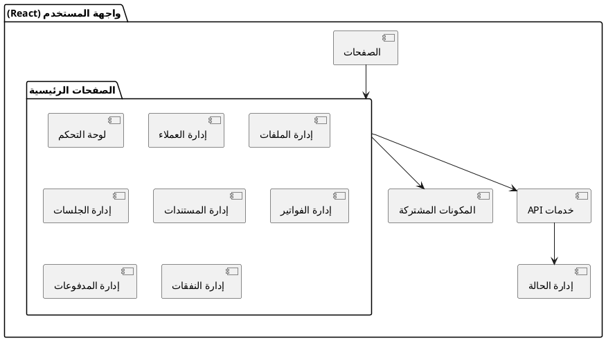

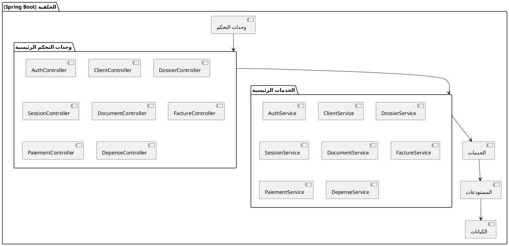

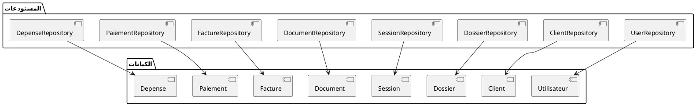

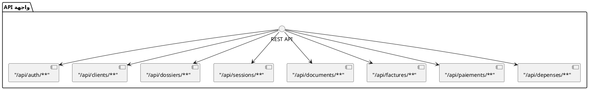

### 3. مخطط حالات الاستخدام (Use Case Diagram)

يوضح هذا المخطط التفاعلات بين المستخدمين والنظام والوظائف المتاحة لكل دور.

#### 3.1 المصادقة وإدارة المستخدمين

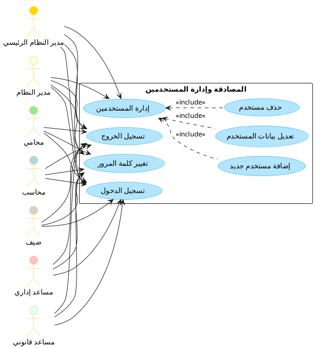

#### 3.2 إدارة العملاء والملفات

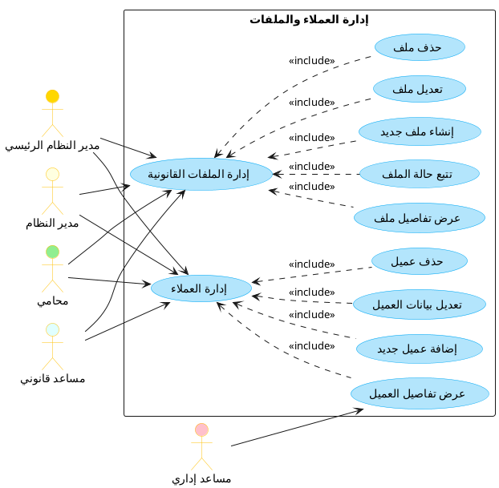

#### 3.3 إدارة الجلسات والمستندات

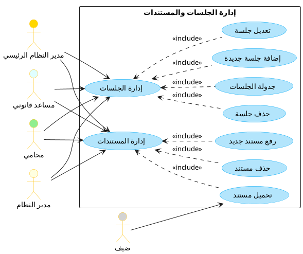

#### 3.4 إدارة الفواتير والمدفوعات والمصاريف

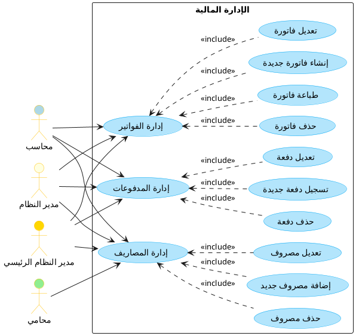

#### 3.5 لوحة التحكم والتقارير

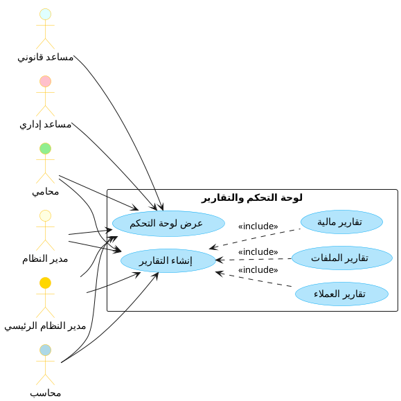

### 4. مخطط التسلسل (Sequence Diagram)

يوضح هذا النوع من المخططات تسلسل العمليات والتفاعلات بين مكونات النظام عبر الزمن.

#### 4.1 مخطط تسلسل لعملية تسجيل الدخول

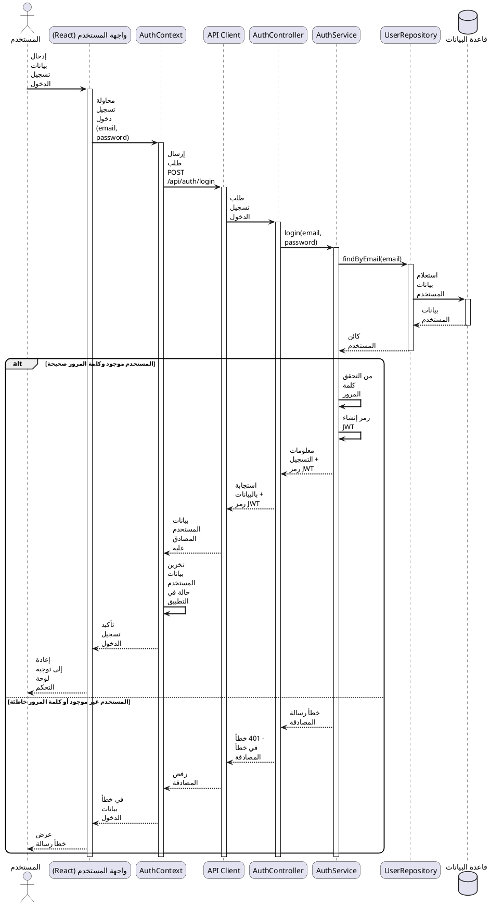

#### 4.2 مخطط تسلسل لإنشاء ملف قضية جديد

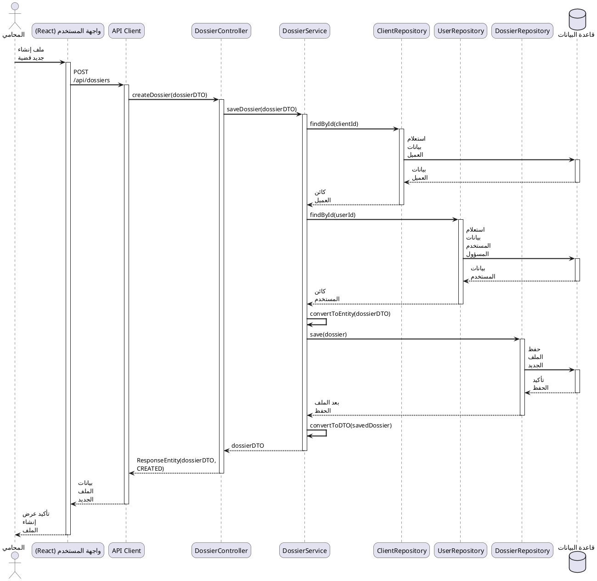

### 5. مخطط النشاط (Activity Diagram)

يوضح هذا النوع من المخططات تدفق العمليات والقرارات في النظام.

#### 5.1 مخطط نشاط لسير عمل إدارة القضايا

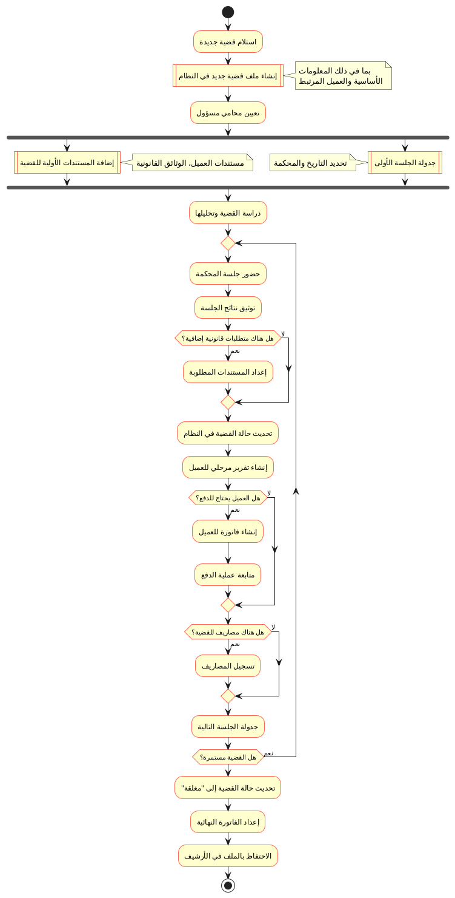

#### 5.2 مخطط نشاط لسير عمل إنشاء الفواتير وتتبع المدفوعات

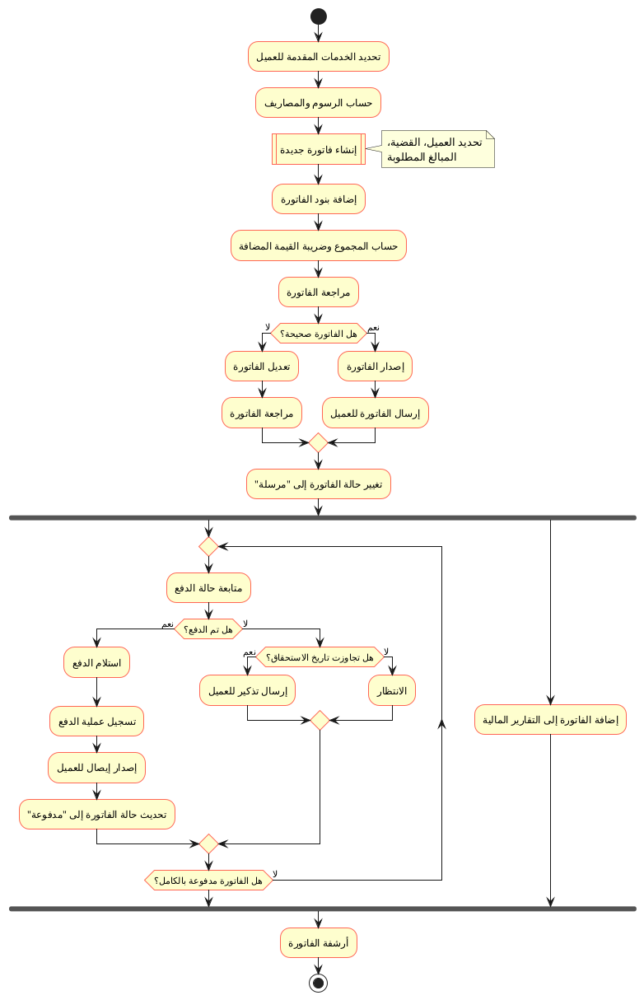

### 6. مخطط الحالة (State Diagram)

يوضح هذا النوع من المخططات التغييرات التي تطرأ على حالة الكائنات في النظام.

#### 6.1 مخطط حالة لتتبع حالة القضية

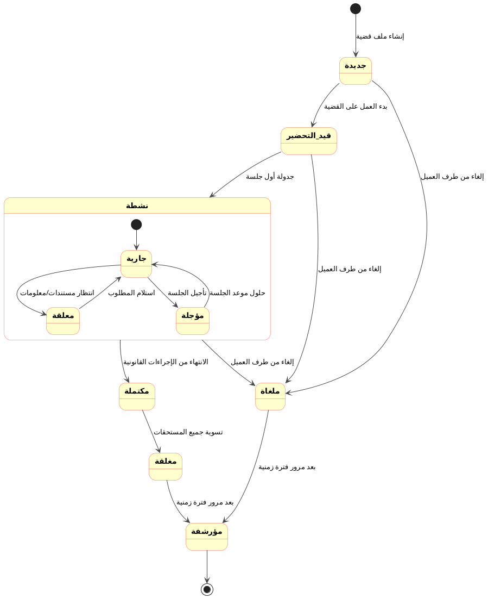

#### 6.2 مخطط حالة لتتبع حالة الفاتورة

```plantuml
@startuml Invoice State Diagram

skinparam state {
  BackgroundColor #FEFECE
  BorderColor #FF6655
  ArrowColor #454645
  FontStyle bold
}

[*] --> مسودة : إنشاء فاتورة جديدة

مسودة --> مصدرة : إصدار الفاتورة
مسودة --> ملغاة : إلغاء الفاتورة

مصدرة --> مرسلة : إرسال للعميل

state مرسلة {
  [*] --> غير_مدفوعة
  غير_مدفوعة --> مدفوعة_جزئيًا : استلام دفعة جزئية
  مدفوعة_جزئيًا --> مدفوعة_جزئيًا : استلام دفعة إضافية
  مدفوعة_جزئيًا --> مدفوعة_بالكامل : استلام باقي المبلغ
  غير_مدفوعة --> مدفوعة_بالكامل : دفع كامل المبلغ
  
  غير_مدفوعة --> متأخرة : تجاوز تاريخ الاستحقاق
  متأخرة --> مدفوعة_جزئيًا : استلام دفعة جزئية
  متأخرة --> مدفوعة_بالكامل : دفع كامل المبلغ
}

مدفوعة_بالكامل --> مغلقة : إغلاق الفاتورة

مرسلة --> معدلة : تعديل بعد الإرسال
معدلة --> مرسلة : إعادة إرسال للعميل

مصدرة --> ملغاة : إلغاء الفاتورة
مرسلة --> ملغاة : إلغاء الفاتورة بعد الإرسال

مغلقة --> [*]
ملغاة --> [*]

@enduml
```

### 7. مخطط توزيع النظام (Deployment Diagram)

يوضح هذا النوع من المخططات كيفية توزيع النظام على المكونات المادية والبرمجية.

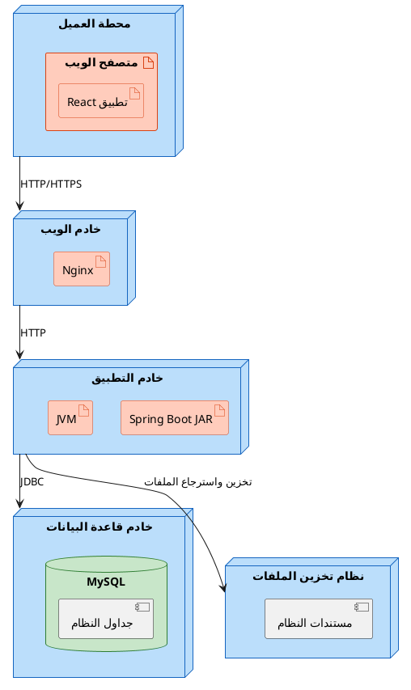

### 8. مخطط الحزم (Package Diagram)

يوضح هذا النوع من المخططات تنظيم الشفرة البرمجية في حزم وعلاقاتها.

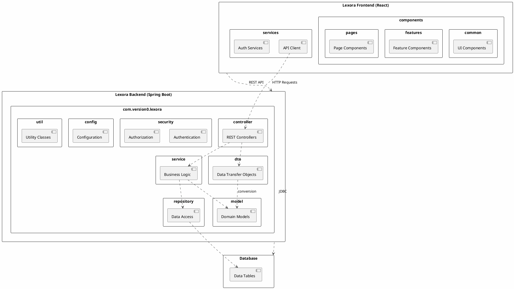

## ملخص

هذه المخططات UML تقدم وصفاً شاملاً لهيكل نظام Lexora من وجهات نظر مختلفة:

1. **مخطط الفئات**: يوضح الهيكل الداخلي التفصيلي للنظام والعلاقات بين الفئات.
2. **مخطط المكونات**: يوفر نظرة عامة على المكونات الرئيسية للنظام وتفاعلاتها.
3. **مخطط حالات الاستخدام**: يوضح تفاعل المستخدمين مع النظام والوظائف المتاحة لكل دور.
4. **مخطط التسلسل**: يوضح تسلسل العمليات والتفاعلات بين مكونات النظام عبر الزمن.
5. **مخطط النشاط**: يوضح تدفق العمليات والقرارات في النظام.
6. **مخطط الحالة**: يوضح التغييرات التي تطرأ على حالة الكائنات في النظام.
7. **مخطط توزيع النظام**: يوضح كيفية توزيع النظام على المكونات المادية والبرمجية.
8. **مخطط الحزم**: يوضح تنظيم الشفرة البرمجية في حزم وعلاقاتها.

هذه المخططات مفيدة للمطورين والمصممين والأشخاص المعنيين بالمشروع لفهم بنية النظام وتفاعلاته، مما يسهل عمليات التطوير والصيانة والتوسع المستقبلي.